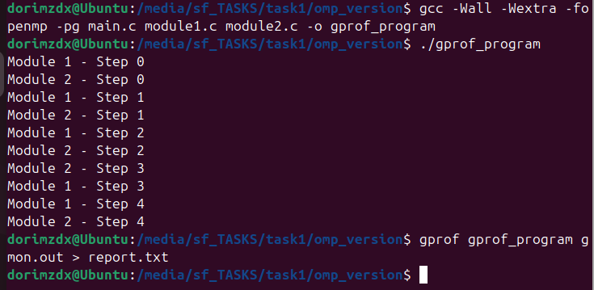
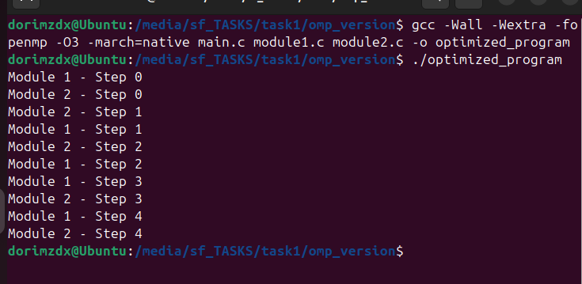
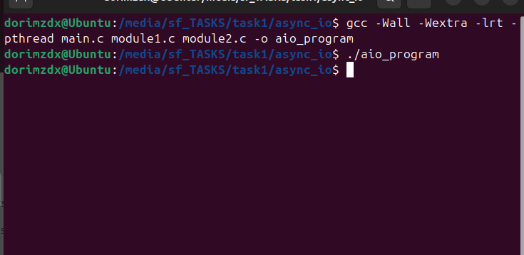
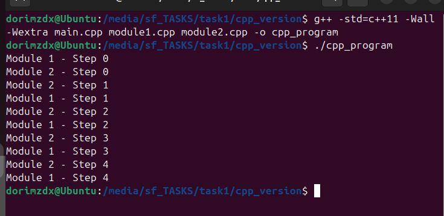

# ЗАВДАННЯ 1.4 
## Умова 
У вас є програма на C, яка складається з кількох модулів (main.c, module1.c, module2.c) та використовує бібліотеку pthread.
Напишіть команду компіляції з підтримкою багатопоточності (-pthread).
Змініть код так, щоб він використовував OpenMP (#pragma omp parallel).
Використовуйте valgrind або gprof для аналізу продуктивності.
gcc -Wall -Wextra -pthread main.c module1.c module2.c -o threaded_program
Оптимізуйте код для роботи з багатоядерними процесорами.
Використовуйте асинхронний ввід/вивід (aio.h) замість стандартного stdio.h.
Реалізуйте версію програми на C++ з використанням std::thread.

## Пояснення 
### 1. Компіляція з підтримкою pthread
Для компіляції багатофайлової програми з підтримкою `pthread` використовується опція `-pthread`: gcc -Wall -Wextra -pthread main.c module1.c module2.c -o threaded_program

### 2. Використання OpenMP
Щоб використовувати OpenMP, у код вставляється директива #pragma omp parallel 
[Код](task1/omp_version/main.c)

### 3. Використання gprof
 
[report.txt](task1/omp_version/report.txt)

### 4. Оптимізація 
OpenMP вже сам по собі додає оптимізацію тому нам залишилось лише скомпілювати з додатковими оптимізаційними прапорами 

### 5. Асинхронний ввід/вивід
Для реалізації асинхронного введення/виведення в програмі ми використали бібліотеку aio.h 
яка дозволяє виконувати операції читання та запису у фоновому режимі(без блокування основного потоку) 
 
[результат1](task1/async_io/module1_output.txt)
[результат2](task1/async_io/module2_output.txt)

### 6. Реалізація на C++
[main.cpp](task1/cpp_version/main.cpp) 

